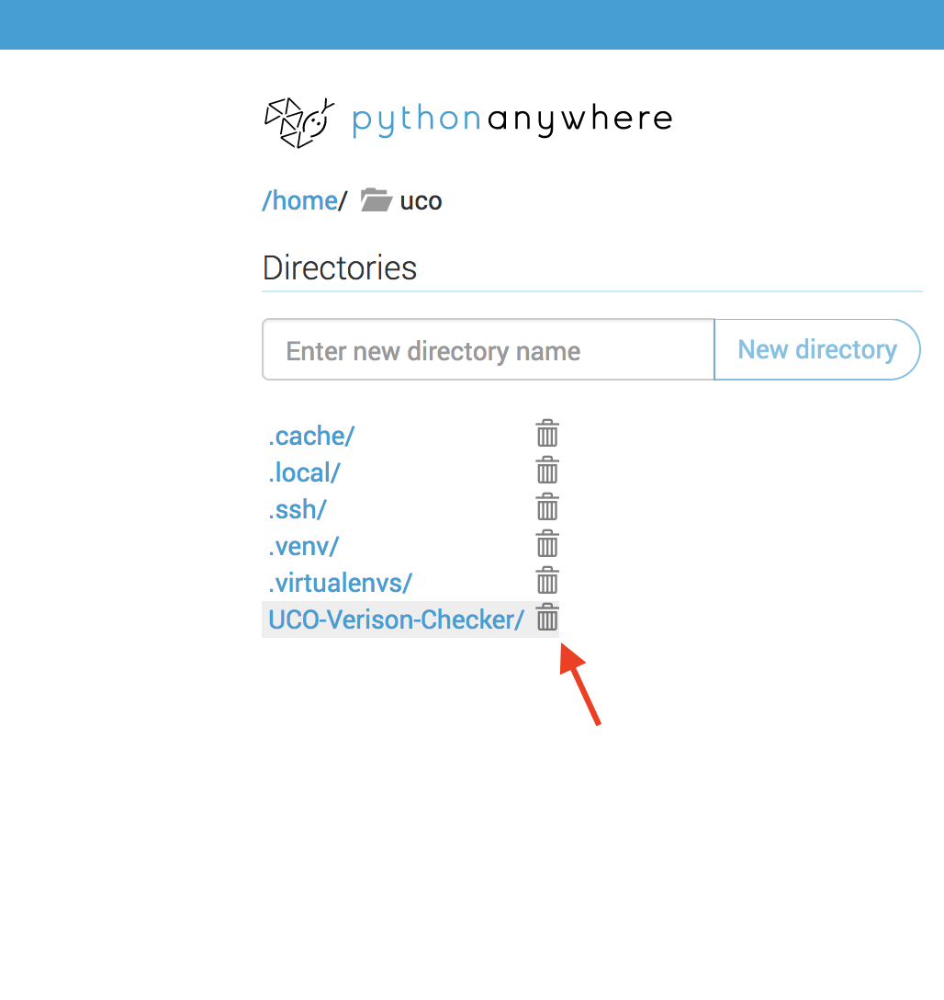
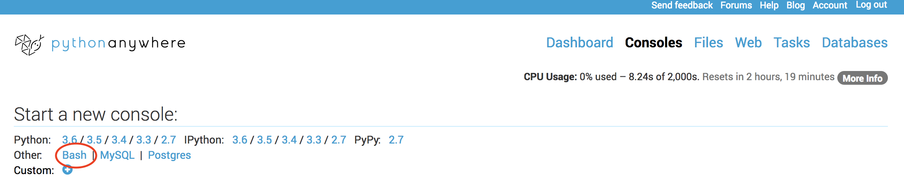
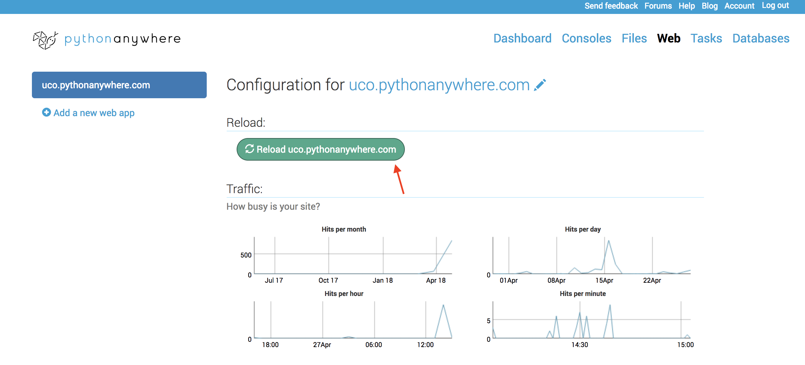

## Team development notes 

### Visit: http://uco.pythonanywhere.com/

### Branches 
- **master:** most stable & deployable working version of our project
- **develop:** changes in progress
- **feature-[whatever feature]:** branch off from develop, merge back into develop 
- **deploy:** the most deployable version that works on PythonAnywhere

### Merging feature branches back to develop branches
`git checkout develop`  
`git merge --no-ff feature-name`  
`git branch -d feature-name` --> Deletes the feature branch once merged  
`git push origin develop`  

### How to push to PythonAnywhere 

1. Login to the University Contract Office's PythonAnywhere account. 
2. Click on the "Files" tab, navigate to the top directory `/home/uco`, and delete the existing repository `UCO-Version-Checker`. If there isn't one, don't worry about it. 

3. Click on the "Consoles" tab and open up a Bash console.

4. `git clone -b branch_name https://github.com/lindatxia/UCO-Verison-Checker.git` 

5. You're almost there! Go back to the "Web" tab and click the green "Reload" button. 

6. Try http://uco.pythonanywhere.com/ and see your latest changes! 

7. (Optional) If you're running into sad error/internal server messages, use error.log and server.log. 