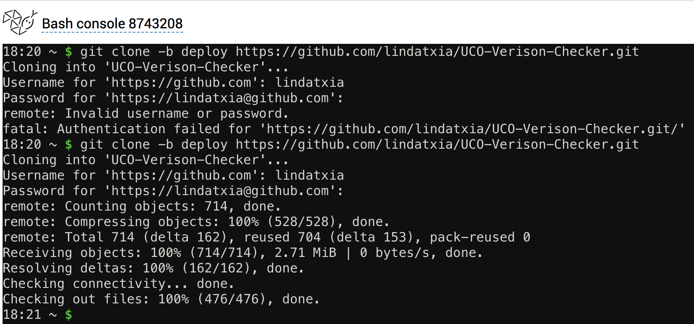

## Team development notes

### Visit: http://uco.pythonanywhere.com/

### Branches
- **master:** most stable & deployable working version of our project
- **deploy:** the most deployable version that works on PythonAnywhere
- **develop:** changes in progress
- **feature-[whatever feature]:** branch off from develop, merge back into develop

Note (5/5/18): we've left it so that master and deploy are essentially the same thing (the most deployable branch).

### Merging feature branches back to develop branches
`git checkout develop`  
`git merge --no-ff feature-name`  
`git branch -d feature-name` --> Deletes the feature branch once merged  
`git push origin develop`  

### How to push to PythonAnywhere
1. Login to the University Contract Office's PythonAnywhere account.
2. Click on the "Files" tab, navigate to the top directory `/home/uco`, and delete the existing repository `UCO-Version-Checker`. If there isn't one, don't worry about it.

3. Click on the "Consoles" tab and open up a Bash console.

4. `git clone -b branch_name https://github.com/lindatxia/UCO-Verison-Checker.git`

5. You're almost there! Go back to the "Web" tab and click the green "Reload" button.

6. Try http://uco.pythonanywhere.com/ and see your latest changes!

7. (Optional) If you're running into sad error/internal server messages, use error.log and server.log.

Alternatively, you can edit within your code within PythonAnywhere, and click "Open new bash console" within the Files tab. Make sure you're in the right git directory. Then simply `git push origin deploy`.

### Modules that we used

- Scrapy spiders to scrape text from web pages (https://doc.scrapy.org/en/latest/topics/spiders.html)
- Python diff for text comparison (https://docs.python.org/2/library/difflib.html)
- Sidecomments.js for text commenting (http://aroc.github.io/side-comments-demo/)
- PythonAnywhere for web hosting (https://help.pythonanywhere.com/pages/Flask/)
- Flask framework (http://flask.pocoo.org/)
- Postgres for database (https://blog.pythonanywhere.com/103/)